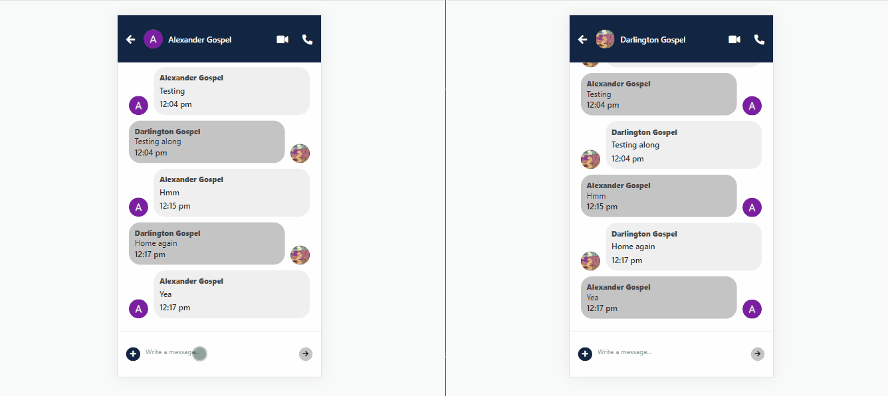
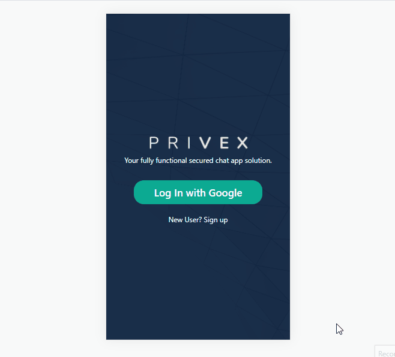

# Build Privex: A Cross-Platform ReactNative Chat App


Read the full tutorial [here](https://medium.com/@smile0307/build-privex-a-cross-platform-reactnative-chat-app-2ff413dc1ca7)

This example shows Build Privex: A Cross-Platform ReactNative Chat App
:



<center><figcaption>Privex Chat Interface</figcaption></center>



<center><figcaption>Privex Overview</figcaption></center>

## Technology

This demo uses:

- React Native
- Firebase
- CometChat
- Formik
- Yup
- Expo

## Running the demo

To run the demo follow these steps:

1. Clone the github project on the terminal `git clone https://github.com/smile930307/privex.git`.
2. Open the project in VSCode and replace the firebase config object with yours from firebase.
   ```js
   const firebaseConfig = {
     apiKey: 'xxx-xxx-xxx-xxx-xxx-xxx-xxx-xxx',
     authDomain: 'xxx-xxx-xxx-xxx-xxx-xxx-xxx',
     databaseURL: 'xxx-xxx-xxx-xxx-xxx-xxx-xxx-xxx-xxx',
     projectId: 'xxx-xxx-xxx',
     storageBucket: 'xxx-xxx-xxx-xxx-xxx',
     messagingSenderId: 'xxx-xxx-xxx',
     appId: 'xxx-xxx-xxx-xxx-xxx-xxx-xxx-xxx',
     measurementId: 'xxx-xxx-xxx',
   }
   ```
3. Create a new file at the root of the folder called "CONSTANTS.js" and paste the codes below into it.
3. ```js
   export const CONSTANTS = {
      APP_ID: 'xxx-xxx-xxx',
      REGION: 'us',
      Auth_Key: 'xxx-xxx-xxx-xxx-xxx-xxx-xxx-xxx',
   }
   ```
4. Include "CONSTANTS.js" in the gitIgnore file stopping from public display. 
3. Open new terminal and run the following commands.
   ```sh
   yarn install
   yarn start
   # The app will lunch on the browser
   ```
4. Open the browser and select the web interface option.

<br/>

Questions about running the demo? [Open an issue](https://github.com/smile930307/privex/issues). We're here to help ✌️

## Useful links

- 🏠 [Website](https://smile0307personalsite.netlify.app/)
- 🔥 [ReactNative](https://reactnative.dev/)
- 🚀 [Firebase](https://firebase.google.com/)
- 🎅 [CometChat](https://firebase.google.com/)
- 🏠 [Expo](https://expo.dev/)
- ✨ [Live Demo](http://privex-d1c15.web.app/)
